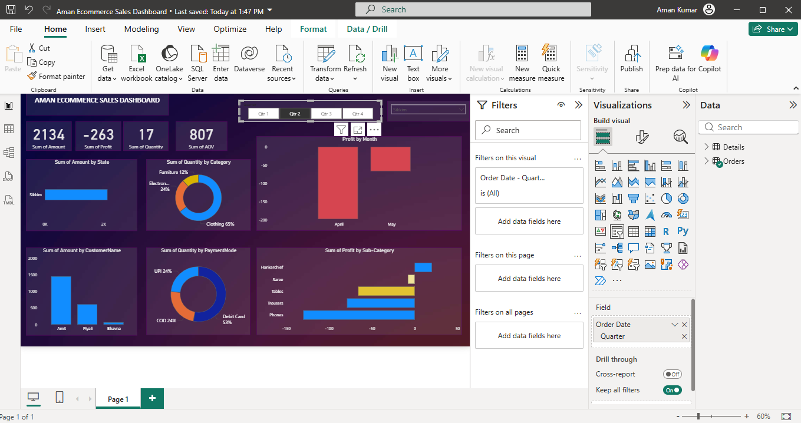
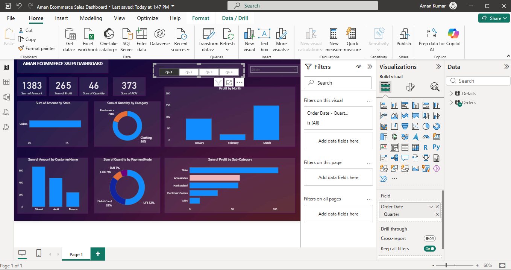

## Project Overview
This Power BI dashboard analyzes ecommerce sales data to identify trends, customer behavior, and category performance.

# Ecommerce Sales Dashboard

This project is a Power BI dashboard analyzing ecommerce sales data.

Tools used:
- Power BI
- Excel

Features:
- Sales analysis
- Customer insights
- Category performance
  
## Dashboard Screenshots

